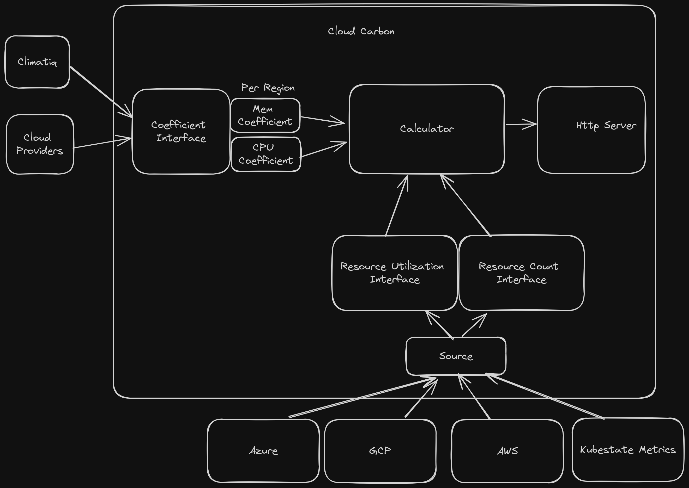

# Aether
A open telemetry exporter to calculate the carbon emissions generated by your cloud infrastructure


Please see the [getting started](./docs/getting-started.md) docs on how to set Aether up

## Architecture Overview




### Explanations

- Coefficient Interface: The coefficent used to calculate the CO2e of various resources
- Source: Where to get the current resource utilization and number of resources 
- Calculator: Using the above inputs to calulate the current CO2e
- HTTP Server: exposes the metrics in various formats

### Local Setup

We use docker compose to run the application locally
please make sure that you edit the volumes in the
[docker-compose.yaml](./docker-compose.yaml) depending on where youre
credentials are.

Also be sure to update your local config with the mounted credentials path.
If docker compose mounts are set as:
```
    volumes:
      # Volume for Google Cloud Credentials
      - ~/.config/gcloud/application_default_credentials.json:/credentials/application_default_credentials.json
      # volume for AWS credentials
      - ~/.aws/credentials:/credentials/credentials
```

the local config should have a `credentials` line under each provider to point
to the correct location:
```
  aws:
    accounts:
      - regions:
        ...
        credentials:
          filePaths:
            - '/credentials/credentials'
  gcp:
    accounts:
      - projects
        ...
        credentials:
          filePaths:
            - '/credentials/application_default_credentials.json'
```

to run locally:

```bash
docker compose up
```
