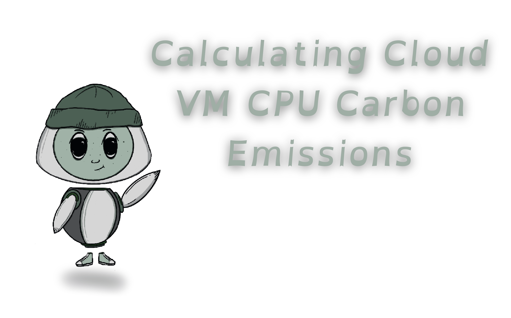
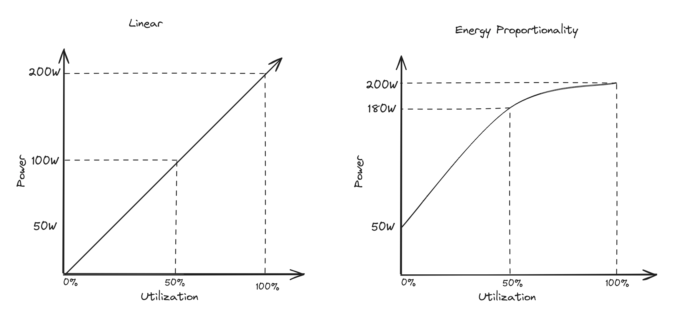
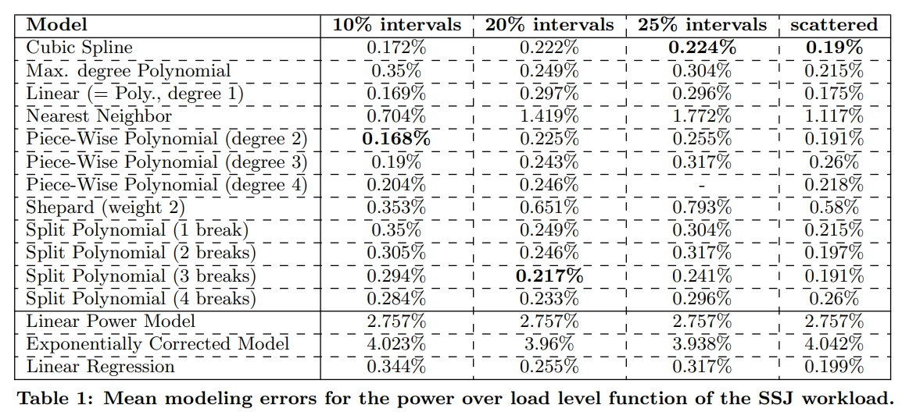

Like many others, we at re:cinq have been attempting to measure energy consumption of virtualized services running on cloud providers.

Our goal is to **provide real-time analytics on cloud service carbon emissions that adhere to OpenTelemetry specification**. We are working towards building upon existing efforts and are hoping to learn, make a difference, and contribute to the initiative.

<br>

## Measuring
When calculating energy consumption of personal machines, it is possible to utilize hardware and kernel features.

For example: A wattage reader can be plugged into the wall to measure total power of the machine, or performance counters, like [Intel's Running Average Power Limit - RAPL](https://www.intel.com/content/www/us/en/developer/articles/technical/software-security-guidance/advisory-guidance/running-average-power-limit-energy-reporting.html) can be accessed to read energy data from [Model Specific Registers - MSRs](https://www.intel.com/content/www/us/en/developer/articles/technical/software-security-guidance/best-practices/reading-writing-msrs-in-linux.html).

However, when working with virtualization technologies, assessing the overall power consumption of the host system lacks insight, as the virtual machine typically utilizes only a fraction of the total energy. Additionally, not all Cloud Providers expose the MSRs utilized by RAPL to gather energy metrics, and if they do, it’s not easily available via tooling, and users must access the data from the process family specific address spaces, making it non-trivial and time consuming. Amazon states in an [AWS security bulletin](https://aws.amazon.com/security/security-bulletins/AWS-2023-005/) that "Amazon EC2 instances, including Lambda, Fargate, and other AWS-managed compute and container services, do not expose power measurement mechanisms, such as Running Average Power Limit (RAPL) or similar interfaces, within the virtualized environment."

Thus, in order to get total operational consumption of virtual machines, an aggregation of the utilized resources must be performed. Specifically: CPU, memory, storage, and networking, with CPU and memory being of the highest utilization factors.


<br>

## Teads
After much research, we decided to utilize and expand on the Teads dataset estimations. [We found their data and calculations to be meticulous and methodically curated](https://medium.com/teads-engineering/estimating-aws-ec2-instances-power-consumption-c9745e347959). They have gathered server specifications and their correlating energy consumption of Amazon EC2 instances by assuming a converting factor on vCPUs based on hardware level consumption of similar infrastructure. Their [dataset](https://docs.google.com/spreadsheets/d/1DqYgQnEDLQVQm5acMAhLgHLD8xXCG9BIrk-_Nv6jF3k/edit?usp=sharing) consists of EC2 instances, server/platform specifications, bare metal power profiles, and ratio data for various component families.

We have stored the Amazon EC2 instance data from Teads as a [YAML](https://github.com/re-cinq/emissions-data/blob/main/data/v2/aws-instances.yaml) file that we read into our code base to calculate emissions.

I *highly* recommend reading their blog posts for an informative explanation of how the data is collected and calculated:
 - [Estimating AWS EC2 Instances Power Consumption](https://medium.com/teads-engineering/estimating-aws-ec2-instances-power-consumption-c9745e347959)
 - [Building an AWS EC2 Cabon Emissions Dataset](https://medium.com/teads-engineering/building-an-aws-ec2-carbon-emissions-dataset-3f0fd76c98ac)

<br>

## Calculating CPU VM Carbon Emissions

To calculate carbon equivalent emissions (CO2e) we first need to calculate the CPU energy consumption of the Cloud VM. To do this, we use the equation:

```
CPUEnergy(kWh) = usage(kW) * vCPUHours(h)
```

Where `usage` is the CPU utilization measured in kilowatts, and `vCPUHours` is the virtual CPU hours over an interval of time. 

Then to get the Carbon Emission Equivalent we use:
```
CPUCO2e(gCO2e/kWh) = CPUEnergy(kWh) * PUE * gridFactor(gCO2e/kWh)
```

Where `PUE` is the Power Usage Effectiveness and `gridFactor` is the grid carbon intensity of the Data Center region.

So the entire equation is:
```
CPUCO2e = usage * vCPUHours * PUE * gridFactor
```

I will go into more detail of each element in the equation, and use the example of calculating the carbon emissions of an **AWS EC2 t3.micro instance running at 27% utilization for 5 minutes in the eu-north-1 region**.

The CPU model for t3.micro instance is a `Xeon Platinum 8175M`, as shown in the dataset or from running `lscpu` in the VM.

```bash
[ec2-user@ip-xxx-xx-xx-xx ~]$ head /proc/cpuinfo 
  processor	: 0
  vendor_id	: GenuineIntel
  cpu family	: 6
  model		: 85
  model name	: Intel(R) Xeon(R) Platinum 8259CL CPU @ 2.50GHz
  stepping	: 7
  microcode	: 0x5003604
  cpu MHz		: 2499.998
  cache size	: 36608 KB
  physical id	: 0
```

<br>

### Calculating vCPU Hours
As mentioned above, **vCPU Hours** represents the count of virtual CPUs within a specific time frame. This will help us determine the energy consumption of underlying physical CPUs running the VM.

- We utilize a window of time known as the `interval` for the collection of metrics. By default this is typically set to 5 minutes or 30 seconds.

- [vCPUs](https://docs.aws.amazon.com/AWSEC2/latest/UserGuide/instance-optimize-cpu.html) are the virtual CPUs that are mapped to physical cores (a core is a physical component to the CPU the VM is running on). They can typically be found by multiplying the number of cores by the number of threads each core can run.

In our example we see the t3.micro instance contains `2 vCPUs`. This value can be found both in the [Teads dataset](https://github.com/re-cinq/emissions-data/blob/main/data/v2/aws-instances.yaml#L33943) and from [AWS](https://aws.amazon.com/ec2/instance-types/t3/).

To get vCPU Hours, we first have to get the interval in hours and multiply that by the number of vCPUs. So with an interval of `5 minutes`, we would calculate vCPU Hours with:

```
vCPUHours = (interval / 60 min) * vCPU
          = (5 / 60) * 2
          = (0.083333333) * 2
          = 0.166666666 vCPUHours
```
<br>

### Calculating CPU Energy Usage

We are utilizing, and building upon, the [power consumption profiles](https://docs.google.com/spreadsheets/d/1DqYgQnEDLQVQm5acMAhLgHLD8xXCG9BIrk-_Nv6jF3k/edit#gid=985503428) from the Teads dataset. They leverage bare-metals of the same machine configuration (or as near to) as the EC2 instance and run a test protocol to get the power information.

To be more specific, they utilize a tool called [turbostat](https://www.linux.org/docs/man8/turbostat.html) that “reports processor topology, frequency, idle power-state statistics, temperature and power on X86 processors” along with [stress-ng](https://github.com/ColinIanKing/stress-ng) to measure the power consumption of the CPU at different loads. 

Taking into account CPU frequency, under and over clocking, and workload types, they were able to come up with Wattage amounts for CPU utilizations of idle, 10%, 50%, and 100% for each instance type. They [validated the accuracy](https://medium.com/teads-engineering/building-an-aws-ec2-carbon-emissions-dataset-3f0fd76c98ac) of their result by comparing the tested CPU and memory consumption (the two largest contributors to total server power consumption) with the power consumption of an entire on-premise server of the same type.

The CPU energy consumption for the t3.micro, Xeon Platinum 8175M, machine with the specified loads are: idle: 1.21, 10%: 3.05, 50%: 7.16, and 100%: 9.96

Now, we use this data to determine the Wattage of the EC2 instance at a specified utilization (in our example, this is 27%). To determine this, we made the following assumptions:
* Server CPU utilization and power consumption are not linear, as seen in the [energy proportionality phenomenon](https://blog.re-cinq.com/posts/energy-proportionality/), so we want to utilize a ***polynomial regression model***.



* We have a set of four data points (0%, 10%, 50%, and 100%), so we can utilize a ***cubic model*** since we have four known values.
* Utilization will not be below 0% or above 100%, so we can use ***interpolation*** to determine a value within this range.

Therefore, for our first iteration, we have opted to use ***cubic spline interpolation*** for predicting the unknown data points.

<br>

#### Cubic Spline Interpolation
[Cubic splines](https://blog.timodenk.com/cubic-spline-interpolation/index.html) are piecewise cubic polynomials that provide a smooth interpolation between data points.

They are designed to maintain continuity in the first and second derivatives, ensuring a continuous and smooth curve. Cubic splines are useful if a more natural and continuous representation of the data is desired, especially when dealing with physical quantities like power consumption.

Cubic Spline interpolation can encounter challenges under specific conditions. We’ve explored how our dataset does not fall within these constraints. Specifically:
 - For extrapolation
     - The data points are bound by a minimum of 0%, and a maximum of 100% utilization, therefore interpolation will be used since CPU utilization will fall between those values, and we won’t be extrapolating beyond them.
 - ["the x values are large and have a large distance between them."](https://www.proven-reserves.com/CubicSplines.php) 
	 - Although "large" is quite an arbitrary term, it's safe to assume that our x-axis of 0, 10, 50, and 100 are neither too large, nor have too large of a distance between them.
 - [Runge's phenomenon](https://www.linkedin.com/advice/3/how-do-you-visualize-interpret-results-runge) - edges oscillate when the polynomial degree is of 5 or more and of evenly spaced nodes
	 -	We are only using a degree of 3, and have a known x-axis of not-evenly spaced values.

A final reasoning for our equation choice arose from the whitepaper by Jóakim von Kistowski and Samuel Kounev “[Univariate Interpolation-based Modeling of Power and Performance](https://eudl.eu/doi/10.4108/eai.14-12-2015.2262579)

They compare various interpolation methods for modeling power and performance of specific datasets. They found that “[Linear] regression is not as accurate as any of the piece-wise polynomial interpolation methods (equi-distant splits, dynamic splits, or splines) in cases of equi-distant data.”. The cubic spline error rate was one of the lowest, if not the lowest, method with their experimentation, as seen in the following table:



We are aware these estimations exclude significant factors and dynamic configurations that should be part of the computation. For example, CPU frequency, dynamic power scaling, running workloads consideration, etc.

A more thorough approach may be to utilize a trained regression model, similar to that of [Kepler](https://sustainable-computing.io/). They have created a [machine learning model](https://sustainable-computing.io/design/power_model/#modeling-approach) that estimates energy consumption of Kubernetes pods with input from performance counters (via ePBF), RAPL, cgroups, and other metrics. We find this method ingenious and innovative, and plan to iterate our approach to something of that caliber.

<br>

#### Calculating VM CPU energy usage with our example
With our instance running at 27% utilization, we can plug that value into the cubic spline interpolation calculation along with the PkgWatt data points. For our use case, we are utilizing the Golang library [gospline](https://github.com/rvql/gospline), and here is a code snippit that can also be found in the [calculator package](https://github.com/re-cinq/cloud-carbon/blob/d770983e3599901233edd1107819604293656e4b/pkg/calculator/calculator.go#L84):

 ```go
 func cubicSplineInterpolation(wattage []data.Wattage, value float64) float64 {
    // split the wattage slice into a slice of
    // float percentages and a slice of wattages
    var x, y = []float64{}, []float64{}
    for _, w := range wattage {
        x = append(x, float64(w.Percentage))
        y = append(y, w.Wattage)
    }

    s := gospline.NewCubicSpline(x, y)
    // s.At returns the cubic spline value in Wattage
    // divide by 1000 to get kilowatts.
    return s.At(value) / 1000
}
```

`wattage` is a slice of structs with the fields `Percentage` and `Wattage`, and consists of the Teads PkgWatt data. `value` is the utilization amount.

Here is the YAML of PkgWatt data for the t3.micro instance.
```yaml
  pkgwatt:
  - percentage: 0
    wattage: 1.21
  - percentage: 10
    wattage: 3.05
  - percentage: 50
    wattage: 7.16
  - percentage: 100
    wattage: 9.96
```
Utilizing these 4 data points, we calculate the CPU energy consumption at 27% utilization to be **0.005324117 kilowatts**.

We need to convert this value to be in hours before we can multiply it by the vCPUHours, so that our units align. This is done
by getting the interval value in seconds, and dividing the usage in kilowatts by that to get the usage in kilowatt seconds. Then
multiply by 3600 to convert seconds to hours.
```
CPUKwH = Usage / interval(seconds) * 3600
       = 0.005324117 / 30 * 3600
       = 0.63889404 kWh

```

Now that we have the CPU usage of the entire server, we need to multiply it by the vCPU hours to get the CPU energy consumption of the VM.

```
CPUEnergy = Usage * vCPUHours
          = 0.63889404 * 0.166666666
          = 0.10648234 kWh
```
 
<br>

## Calculating VM CPU CO₂e

The final step in the calculations is to convert the CPUEnergy into a Carbon Emission Equivalent. To do that, we must multiply CPUEnergy by PUE and a grid carbon intensity coefficient factor.

```
CPUCO2e = CPUEnergy * PUE * gridFactor
```

Both of these data coefficients can be found in our [Emissions Data](https://github.com/re-cinq/emissions-data) repository. This is where we keep, and update coefficient data that is utilized by cloud-carbon.

<br>

### PUE
The PUE - [Power Usage Effectiveness](https://en.wikipedia.org/wiki/Power_usage_effectiveness) is how effective a data center’s energy is. In other words, how much of their electricity usage is consumed by server computation (as opposed to cooling, lights, etc.). It is a ratio, and the lowest possible value is 1.0 depicting *all* electricity is going to the [servers](https://blog.re-cinq.com/posts/green-data-centers/).

We were unable to find a published PUE score from Amazon, so we made a conservative estimation of `1.2` based on an older [blog](https://aws.amazon.com/blogs/aws/cloud-computing-server-utilization-the-environment/). This value also coincides with the [reports of GCP](https://www.google.com/about/datacenters/efficiency/) having the most effective data centers with an average score of `1.1` across all regions. They also provide quarterly, region-specific PUE scores.


<br>

### Grid Carbon Intensity Coefficient
The grid carbon intensity is a coefficient value of a power grid’s carbon emissions. Some providers have specific information regarding what kind of energy is being utilized in each data center e.g. wind farms that feed directly into their data centers. For instance, GCP provides [public information](https://cloud.google.com/sustainability/region-carbon) about the regional carbon grid intensity. It seems that AWS suggests using [electricity maps](https://app.electricitymaps.com/map) to get the regional grid carbon intensity value. However, since the API is not a free service, we opted to follow in the footsteps of the [Cloud Carbon Footprint’s](https://www.cloudcarbonfootprint.org/docs/methodology/#carbon-estimates-co2e) initial methodologies of using [carbon footprint](carbonfootprint.com), [EEA emissions factors](https://www.eea.europa.eu/data-and-maps/daviz/co2-emission-intensity-14/), and the [EPA’s eGRID2020 Data](https://www.epa.gov/egrid/download-data).

So, based on the 2022 [EEA emissions factors](https://www.eea.europa.eu/data-and-maps/daviz/co2-emission-intensity-14#tab-chart_6) for eu-north-1 region (Sweden), we found a grid carbon intensity of `7 gCO2eq/kWh`.

<br>

### Final Calculations

Now, we can put it all together and get the CPU Carbon Emission Equivalents for a t3.micro AWS EC2 instance running at 27% utilization for 5 minutes in the eu-north-1 region

```
CPUCO2e = CPUEnergy * PUE * gridFactor
        = 0.10648234 * 1.2 * 7
        = 0.894451652 gCO2eq/kWh

or, elongated is:
CPUCO2e = usage * vCPUHours * PUE * gridFactor
        = 0.63889404 * 0.166666666 * 1.2 * 7
        = 0.894451652 gCO2eq/kWh
```

Therefore, we estimated the t3.micro VM CPU carbon emissions to be **0.007453764 gCO2eq/kWh** over 5 minutes.

As a reminder, this is only for CPU. To get the total CO₂e emissions for a service running on the cloud we also need to add calculations for memory, storage, and networking; which we plan to show in future posts.

<br>

## Additional work

<br>

#### GCP
We have been working on creating a similar dataset implementation for GCE instances, but are waiting on responses from Google, and subsequently working on [getting access](https://github.com/re-cinq/emissions-data/blob/main/docs/HELP.md) to bare-metal infrastructure. We are following a similar approach to the Teads dataset, by using comparable machine architecture families and `turbostress` to get wattage data at various workloads. In the meantime, our service still calculated CPU CO₂e for GCE, by using a “fallback” method of leveraging the SPECpower min and max server wattage to estimate CPU power consumption, similar to the [CCF](https://www.cloudcarbonfootprint.org/docs/methodology/#compute).

<br>

#### Memory, Storage, Networking
We are implementing a similar equation for calculating memory, but using the RAMWatt readings as the wattage variables. We will do a similar write up on that next. Then move onto storage and networking.

<br>

#### Embodied Emissions
As part of the overall emissions equations, calculating the [embodied emissions](https://blog.re-cinq.com/posts/embodied-carbon/) is equally as important. We are in the process of writing up a methodology for how we go about calculating those, and it can be read shortly.

<br>

## Conclusion
Calculating energy consumption of VMs running in cloud data centers is nontrivial. We expect the work we are doing to be iterated on, and continually improving. We find the biggest challenge comes from the lack of transparency from cloud providers. Any help is greatly appreciated in growing our datasets, improving our calculations, or collaborating in any way.

<br>

## Resources
  - [The MSRs of EC2](https://www.brendangregg.com/blog/2014-09-15/the-msrs-of-ec2.html)
  - [turbostat](https://www.linux.org/docs/man8/turbostat.html)
  - [Estimating AWS EC2 Instances Power Consumption](https://medium.com/teads-engineering/estimating-aws-ec2-instances-power-consumption-c9745e347959)
  - [Building an AWS EC2 Cabon Emissions Dataset](https://medium.com/teads-engineering/building-an-aws-ec2-carbon-emissions-dataset-3f0fd76c98ac)
  - [Cloud Carbon Footprint](https://www.cloudcarbonfootprint.org/docs/methodology)
  - [Teads Dataset](https://docs.google.com/spreadsheets/d/1DqYgQnEDLQVQm5acMAhLgHLD8xXCG9BIrk-_Nv6jF3k/edit)
  - [Teads AWS YAML](https://github.com/re-cinq/emissions-data/blob/main/data/v2/aws-instances.yaml)
  - [cloud-carbon GitHub repo](https://github.com/re-cinq/cloud-carbon)
  - [Exploring Keplers Potential Unveiling Cloud Application Power Consumption](https://www.cncf.io/blog/2023/10/11/exploring-keplers-potentials-unveiling-cloud-application-power-consumption/)
  - [Energy Consumption Model for Virtual Machines in Cloud Data Centre](https://www.warse.org/IJATCSE/static/pdf/file/ijatcse05914sl2020.pdf)
  - [Virtual Machine Power Modelling in Multi-tenant Ecosystems: Challenges and Pitfalls](https://www.dpss.inesc-id.pt/~lveiga/papers/ICT-Energy_Letters_10_lsharifi.pdf)
  - [The problem with cubic splines](https://www.proven-reserves.com/CubicSplines.php)
  - [Univariate Interpolation-based Modeling of Power and Performance](https://eudl.eu/doi/10.4108/eai.14-12-2015.2262579)
